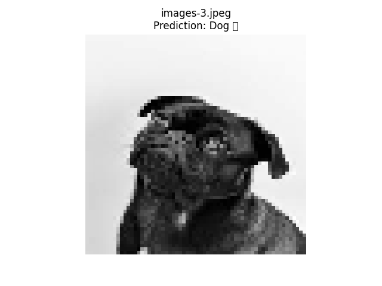
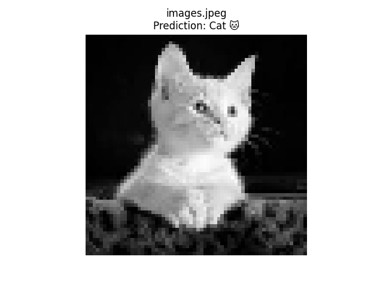

# 🐱🐶 Cat vs Dog Image Classifier using SVM

This project is a simple image classifier that uses **Support Vector Machine (SVM)** to classify images as either **Cat** or **Dog**. Built during a machine learning internship, it demonstrates the complete pipeline — from image preprocessing to model training and prediction.

---

## 📂 Project Structure

cat-dog-svm Task 3/
├── train/ # Folder containing training images (Cat/Dog)
├── test_images/ # Folder with test images for prediction
├── svm_cat_dog_model.pkl # Saved trained SVM model
├── svm_cat_dog.py # Script to train the model
├── predict_single_image.py # Predict a single image
├── predict_all_images.py # Predict all images in test_images
├── README.md # Project documentation

---

---

## 🛠️ Technologies Used

- Python
- Scikit-learn (SVM)
- OpenCV (cv2)
- NumPy
- Matplotlib

---

## 🧠 Model Summary

- **Model Used:** Support Vector Machine (SVC from scikit-learn)
- **Features:** Images are resized to 64x64 grayscale and flattened into a 1D array.
- **Training Data:** Labeled set of cat and dog images.
- **Test Prediction:** On unseen images.

---

## 📊 Sample Predictions

Below are sample predictions made by the SVM model on test images:

### 🐶 Dog Prediction


*Prediction: Dog 🐶*

---

### 🐱 Cat Prediction


*Prediction: Cat 🐱*


---

- 📷 Description: A white cat sitting in front of a dark background.
- 🧠 **Prediction by Model:** `Cat`
- ✅ **Result:** Correct

---

## 🚀 How to Run

1. Clone the repository:
   ```bash
   git clone https://github.com/prashantyadav12/PRODIGY_ML_03.git
   cd cat-dog-svm\ Task\ 3

✍️ Author
Prashant Yadav
B.Tech CSE (AI)
GitHub: @prashantyadav12
